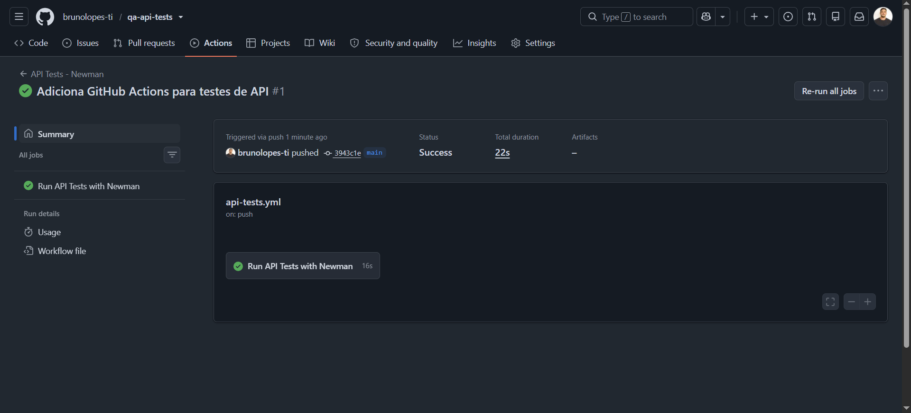

# QA API Tests - Postman, Newman e REST API


Projeto prático de **testes de API REST** utilizando Postman, Newman, JavaScript e JSONPlaceholder.

O projeto demonstra criação e execução de uma suíte de testes de API, validação de endpoints, métodos HTTP, status codes, payloads JSON, scripts JavaScript, uso de variáveis, execução via terminal e integração contínua com **GitHub Actions**.

---

## Tecnologias utilizadas

- Postman;
- Newman;
- JavaScript;
- Node.js;
- REST API;
- JSON;
- JSONPlaceholder;
- GitHub Actions;
- npm;
- Git;
- GitHub;
- Markdown;
- Visual Studio Code.

---

## API utilizada

Aplicação utilizada nos testes:

[JSONPlaceholder](https://jsonplaceholder.typicode.com/)

O JSONPlaceholder é uma API REST pública utilizada para estudos e práticas de testes, permitindo trabalhar com operações de consulta, criação, atualização e exclusão de recursos.

---

## Objetivo do projeto

Demonstrar práticas de testes de API REST utilizando Postman e Newman, cobrindo diferentes métodos HTTP e validações comuns no trabalho de QA.

A collection foi criada no Postman e posteriormente integrada à execução via terminal com Newman.

O projeto também possui pipeline configurado com GitHub Actions, permitindo que a suíte de testes seja executada automaticamente durante eventos de `push` e `pull_request`.

---

## Escopo dos testes

A suíte contempla os seguintes métodos HTTP:

- `GET`;
- `POST`;
- `PATCH`;
- `DELETE`.

Também foram aplicadas validações envolvendo:

- Status codes;
- Dados retornados pela API;
- Payload JSON;
- Estrutura básica da resposta;
- Campos esperados;
- Armazenamento de variáveis;
- Reaproveitamento de dados entre requisições;
- Scripts JavaScript no Postman;
- Execução via Newman;
- Execução automatizada com GitHub Actions.

---

## Estrutura do projeto

```text
qa-api-tests/
├── .github/
│   └── workflows/
│       └── api-tests.yml
├── collections/
│   └── QA Lab - API Tests (JSONPlaceholder).postman_collection.json
├── prints/
│   ├── get-tests.png
│   ├── post-tests.png
│   ├── patch-tests.png
│   ├── delete-tests.png
│   ├── newman-run-passando.png
│   └── github-actions-api-tests-passando.png
├── .gitignore
├── package.json
├── package-lock.json
└── README.md
```

---

# Collection Postman

Arquivo:

```text
collections/QA Lab - API Tests (JSONPlaceholder).postman_collection.json
```

A collection contém as requisições e respectivos scripts de teste utilizados para validar as operações da API.

Os testes foram implementados utilizando JavaScript no Postman para verificar propriedades das respostas e critérios esperados para cada endpoint.

---

# Cenários testados

## CT-01 - GET - Consultar posts

**Objetivo:** validar a consulta de recursos disponíveis na API.

### Validações realizadas

- Status code `200`;
- Retorno de uma lista de posts;
- Presença de dados na resposta;
- Estrutura esperada no payload JSON.

### Evidência

```text
prints/get-tests.png
```


---

## CT-02 - POST - Criar recurso

**Objetivo:** validar o envio de uma requisição para criação de recurso.

### Validações realizadas

- Status code `201`;
- Retorno de ID;
- Validação dos dados enviados no payload;
- Armazenamento do ID retornado em variável.

### Evidência

```text
prints/post-tests.png
```


---

## CT-03 - PATCH - Atualizar recurso

**Objetivo:** validar a atualização parcial de um recurso.

### Validações realizadas

- Status code `200`;
- Retorno do campo atualizado;
- Validação do conteúdo alterado.

### Evidência

```text
prints/patch-tests.png
```


---

## CT-04 - DELETE - Remover recurso

**Objetivo:** validar a execução da operação de exclusão.

### Validações realizadas

- Status code `200` ou `204`;
- Confirmação da execução da requisição `DELETE`.

### Evidência

```text
prints/delete-tests.png
```


---

# Fluxo da suíte

O fluxo utilizado no projeto pode ser representado por:

```text
Postman
   ↓
Collection
   ↓
Requisições HTTP
   ↓
API REST
   ↓
Resposta JSON
   ↓
Scripts JavaScript
   ↓
Assertions
   ↓
Newman
   ↓
GitHub Actions
```

Essa estrutura permite executar as mesmas validações tanto no Postman quanto fora da interface gráfica.

---

# Uso de variáveis

O projeto utiliza variáveis para armazenar e reaproveitar informações retornadas pelas requisições.

Um dos exemplos é o armazenamento do ID retornado após uma operação de criação.

Esse tipo de abordagem permite trabalhar com dados de maneira dinâmica e preparar a suíte para fluxos onde uma requisição depende de informações obtidas anteriormente.

---

# Execução com Newman

A collection também foi configurada para ser executada via terminal utilizando **Newman**.

Isso permite executar os testes sem depender da interface gráfica do Postman e facilita a integração da suíte com pipelines de CI/CD.

---

## Instalação das dependências

```bash
npm install
```

---

## Executar a suíte

```bash
npm run api
```

Também é possível executar diretamente com Newman:

```bash
npx newman run "collections/QA Lab - API Tests (JSONPlaceholder).postman_collection.json"
```

---

# Script npm

O projeto possui o seguinte script no `package.json`:

```json
"scripts": {
  "api": "newman run \"collections/QA Lab - API Tests (JSONPlaceholder).postman_collection.json\""
}
```

Isso permite executar toda a suíte com:

```bash
npm run api
```

---

# Resultado da execução via terminal

A collection foi executada com Newman e apresentou o seguinte resultado:

```text
iterations:          1 executada / 0 falhas
requests:            4 executadas / 0 falhas
test-scripts:        8 executados / 0 falhas
prerequest-scripts:  5 executados / 0 falhas
assertions:         11 executadas / 0 falhas
```

Resumo:

| **Indicador** | **Resultado** |
|---|---:|
| Requisições | 4 |
| Test Scripts | 8 |
| Pre-request Scripts | 5 |
| Assertions | 11 |
| Falhas | 0 |
| Resultado | Passed |

### Evidência


---

# Execução automatizada com GitHub Actions

O projeto possui workflow configurado com **GitHub Actions** para executar automaticamente os testes de API com Newman.

O workflow é acionado nos eventos:

```text
push
pull_request
```

na branch:

```text
main
```

### Etapas do pipeline

- Checkout do repositório;
- Configuração do Node.js;
- Instalação das dependências com `npm ci`;
- Execução da suíte de API com `npm run api`.

Arquivo:

```text
.github/workflows/api-tests.yml
```

### Evidência



---

# Workflow GitHub Actions

Configuração utilizada:

```yaml
name: API Tests - Newman

on:
  push:
    branches: [ main ]
  pull_request:
    branches: [ main ]

jobs:
  api-tests:
    name: Run API Tests with Newman
    runs-on: ubuntu-latest

    steps:
      - name: Checkout repository
        uses: actions/checkout@v5

      - name: Setup Node.js
        uses: actions/setup-node@v5
        with:
          node-version: lts/*

      - name: Install dependencies
        run: npm ci

      - name: Run API tests
        run: npm run api
```

---

# Boas práticas aplicadas

- Organização da collection em pasta específica;
- Separação dos cenários por método HTTP;
- Validação de status codes;
- Validação de payload JSON;
- Scripts JavaScript no Postman;
- Uso de assertions;
- Uso de variáveis;
- Reaproveitamento de dados entre requisições;
- Execução via terminal com Newman;
- Script npm para simplificar a execução;
- Execução automatizada com GitHub Actions;
- Pipeline acionado em `push` e `pull_request`;
- Registro de evidências;
- Documentação técnica;
- Controle de dependências com `package.json`;
- Uso de `.gitignore`;
- Versionamento com Git e GitHub.

---

# Competências demonstradas

Este projeto demonstra conhecimentos práticos em:

- Quality Assurance;
- API Testing;
- REST API;
- Postman;
- Newman;
- JavaScript;
- Node.js;
- JSON;
- Métodos HTTP;
- `GET`;
- `POST`;
- `PATCH`;
- `DELETE`;
- Status codes;
- Payloads;
- Assertions;
- Scripts de teste;
- Pre-request Scripts;
- Variáveis;
- Encadeamento de dados;
- Execução via CLI;
- Automação de testes de API;
- GitHub Actions;
- CI/CD;
- Git;
- GitHub;
- Evidências de execução;
- Documentação técnica.

---

# Status do projeto

**Concluído nesta etapa.**

O projeto atualmente demonstra:

- Collection criada no Postman;
- 4 requisições REST;
- Métodos GET, POST, PATCH e DELETE;
- Scripts JavaScript;
- Uso de variáveis;
- Validação de payloads;
- Validação de status codes;
- 11 assertions executadas;
- Execução via Newman;
- 0 falhas na execução registrada;
- Script npm;
- Pipeline com GitHub Actions;
- Evidências de execução;
- Documentação no GitHub.

---

# Próximas melhorias possíveis

- Criar arquivo de Environment do Postman;
- Expandir o uso de variáveis de ambiente;
- Trabalhar autenticação e tokens;
- Adicionar testes negativos;
- Adicionar validações de schema JSON;
- Expandir o encadeamento entre requisições;
- Trabalhar dados de teste externos;
- Adicionar relatório HTML do Newman;
- Expandir a suíte para uma API com persistência real de dados;
- Explorar fluxos autenticados;
- Evoluir posteriormente para cenários envolvendo OAuth 2.0 e webhooks.

---

# Autor

**Bruno Ramos Lopes**

LinkedIn: [linkedin.com/in/brunolopes-ti](https://linkedin.com/in/brunolopes-ti)  
GitHub: [github.com/brunolopes-ti](https://github.com/brunolopes-ti)
