# QA API Tests - Postman, Newman e REST API


Projeto prático de **testes automatizados de API REST** utilizando Postman, Newman e JavaScript.

O projeto foi desenvolvido em duas etapas: uma suíte inicial utilizando **JSONPlaceholder**, voltada aos fundamentos de testes de API, e uma suíte avançada utilizando **Restful Booker**, contemplando autenticação, variáveis de ambiente, encadeamento de requisições, CRUD completo, validação de schema, testes negativos e execução automatizada em CI/CD.

---

## Tecnologias utilizadas

- Postman;
- Newman;
- JavaScript;
- Node.js;
- npm;
- REST API;
- JSON;
- JSON Schema;
- JSONPlaceholder;
- Restful Booker;
- GitHub Actions;
- Git;
- GitHub;
- Visual Studio Code.

---

## Objetivo do projeto

Demonstrar conhecimentos práticos em testes de API REST, desde validações fundamentais até a construção de fluxos automatizados com dependência entre requisições.

O projeto contempla:

- Criação e organização de collections no Postman;
- Métodos HTTP;
- Validação de status codes;
- Validação de payloads JSON;
- Scripts JavaScript;
- Assertions;
- Variáveis de ambiente;
- Autenticação por token;
- Encadeamento de requisições;
- CRUD completo;
- Validação de JSON Schema;
- Testes positivos e negativos;
- Execução via Newman;
- Scripts npm;
- Integração contínua com GitHub Actions;
- Registro de evidências.

---

# APIs utilizadas

## JSONPlaceholder

API REST pública utilizada na etapa inicial do projeto para prática dos fundamentos de testes de API.

Foram trabalhadas operações de:

- Consulta;
- Criação;
- Atualização parcial;
- Exclusão.

---

## Restful Booker

API pública utilizada para evolução da suíte e implementação de cenários mais próximos de fluxos reais.

Com ela foram praticados:

- Health Check;
- Autenticação;
- Geração e armazenamento de token;
- Criação dinâmica de booking;
- Armazenamento de `bookingId`;
- Consulta;
- Atualização completa com `PUT`;
- Atualização parcial com `PATCH`;
- Exclusão;
- Validação da exclusão;
- JSON Schema;
- Testes negativos.

---

# Estrutura do projeto

```text
qa-api-tests/
├── .github/
│   └── workflows/
│       └── api-tests.yml
│
├── collections/
│   ├── QA Lab - API Tests (JSONPlaceholder).postman_collection.json
│   └── QA API Advanced - Restful Booker.postman_collection.json
│
├── environments/
│   └── Restful Booker - QA.postman_environment.json
│
├── prints/
│   ├── get-tests.png
│   ├── post-tests.png
│   ├── patch-tests.png
│   ├── delete-tests.png
│   ├── newman-run-passando.png
│   ├── newman-restful-booker-success.png
│   ├── newman-all-api-tests-success.png
│   ├── restful-booker-health-check.png
│   ├── restful-booker-create-booking.png
│   ├── restful-booker-get-booking.png
│   ├── restful-booker-schema-validation.png
│   ├── restful-booker-put-booking.png
│   ├── restful-booker-patch-booking.png
│   ├── restful-booker-delete-booking.png
│   ├── restful-booker-delete-validation.png
│   ├── restful-booker-invalid-auth.png
│   ├── restful-booker-update-without-auth.png
│   ├── restful-booker-invalid-payload.png
│   └── github-actions-api-tests-job-success.png
│
├── .gitignore
├── package.json
├── package-lock.json
└── README.md
```

---

# Suíte 1 - JSONPlaceholder

A primeira collection foi criada para praticar os fundamentos de testes automatizados de APIs REST.

Arquivo:

```text
collections/QA Lab - API Tests (JSONPlaceholder).postman_collection.json
```

## Cenários

### CT-01 - GET - Consultar posts

Validações:

- Status code `200`;
- Retorno de dados;
- Estrutura da resposta.

### CT-02 - POST - Criar recurso

Validações:

- Status code `201`;
- Retorno de ID;
- Dados enviados no payload;
- Armazenamento de variável.

### CT-03 - PATCH - Atualizar recurso

Validações:

- Status code `200`;
- Atualização parcial;
- Conteúdo retornado.

### CT-04 - DELETE - Remover recurso

Validações:

- Status esperado;
- Execução da operação de exclusão.

---

## Resultado da suíte básica

Execução com Newman:

```text
Requests:    4
Assertions: 11
Failures:    0
Resultado:  Passed
```

### Evidência

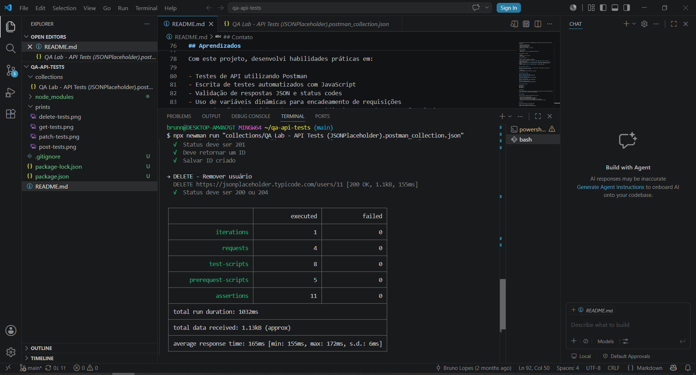

---

# Suíte 2 - Restful Booker

A segunda collection representa a evolução técnica do projeto.

Arquivo:

```text
collections/QA API Advanced - Restful Booker.postman_collection.json
```

Environment:

```text
environments/Restful Booker - QA.postman_environment.json
```

A suíte contém **11 requisições** e **36 assertions automatizadas**.

---

## CT-01 - Health Check

```http
GET /ping
```

Validações:

- Status code `201`;
- Tempo de resposta inferior ao limite definido.

### Evidência

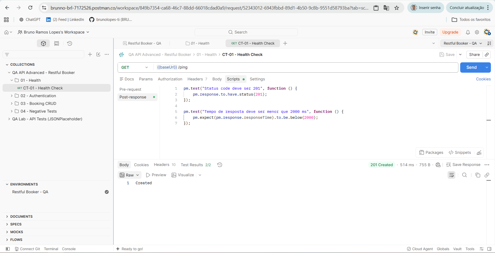

---

## CT-02 - Gerar token de autenticação

```http
POST /auth
```

Validações:

- Status code `200`;
- Presença do token;
- Armazenamento automático no Environment.

O token retornado pela API é armazenado dinamicamente:

```javascript
pm.environment.set("token", response.token);
```

---

## CT-03 - Criar booking

```http
POST /booking
```

Validações:

- Status code `200`;
- Retorno de `bookingid`;
- Dados enviados;
- Armazenamento dinâmico do ID.

```javascript
pm.environment.set("bookingId", response.bookingid);
```

### Evidência

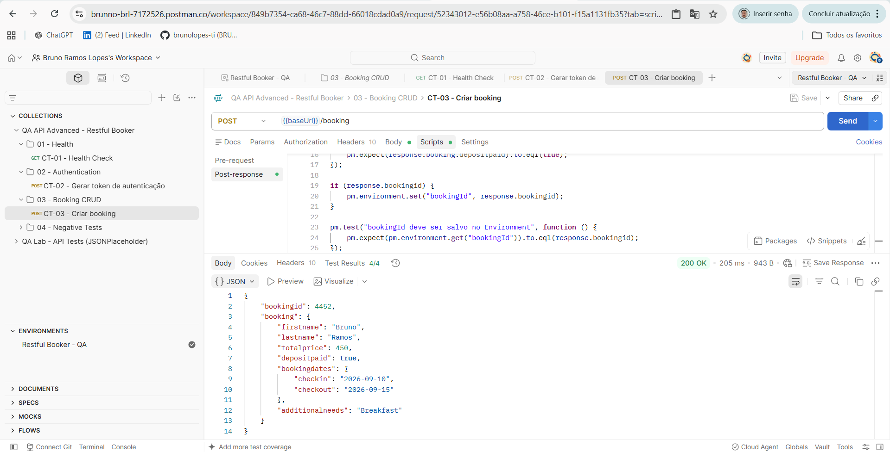

---

## CT-04 - Consultar booking criado

```http
GET /booking/{{bookingId}}
```

Validações:

- Status code `200`;
- Nome;
- Sobrenome;
- Valor;
- Datas;
- Necessidade adicional;
- Schema JSON.

### JSON Schema

A estrutura da resposta também é validada utilizando JSON Schema.

Exemplo:

```javascript
pm.test("Schema da resposta deve ser válido", function () {
    pm.response.to.have.jsonSchema(schema);
});
```

### Evidência

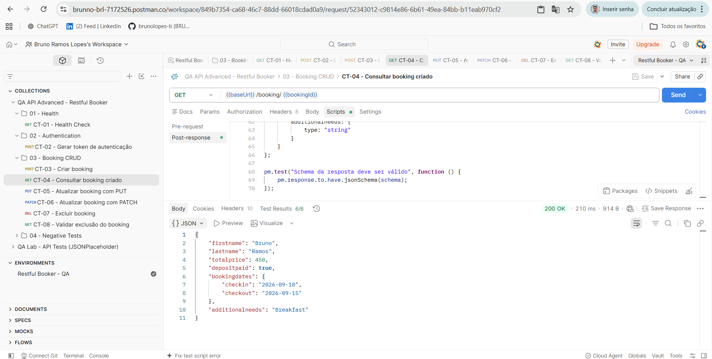

---

## CT-05 - Atualizar booking com PUT

```http
PUT /booking/{{bookingId}}
```

A requisição utiliza o token criado anteriormente:

```text
Cookie: token={{token}}
```

Validações:

- Status code `200`;
- Atualização dos dados;
- Alteração do valor;
- Alteração do depósito;
- Atualização das datas.

### Evidência

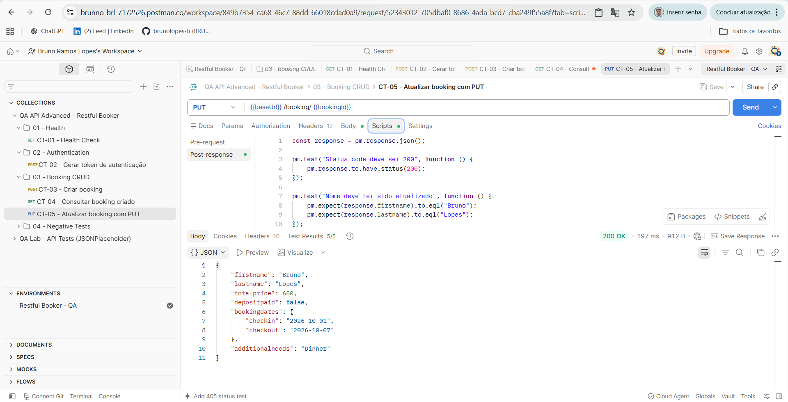

---

## CT-06 - Atualizar booking com PATCH

```http
PATCH /booking/{{bookingId}}
```

Validações:

- Atualização parcial;
- Campos alterados;
- Preservação dos campos não modificados.

### Evidência

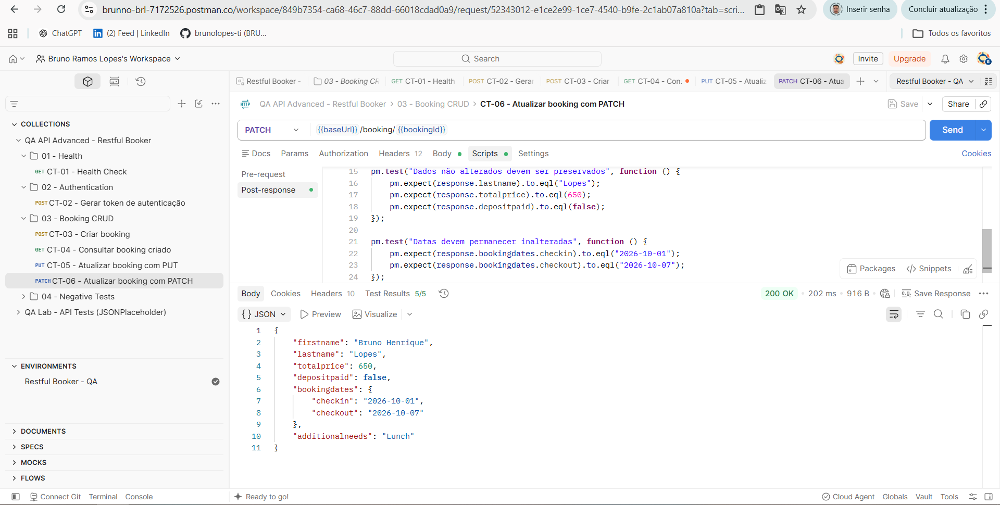

---

## CT-07 - Excluir booking

```http
DELETE /booking/{{bookingId}}
```

Validações:

- Status code `201`;
- Confirmação da exclusão.

### Evidência

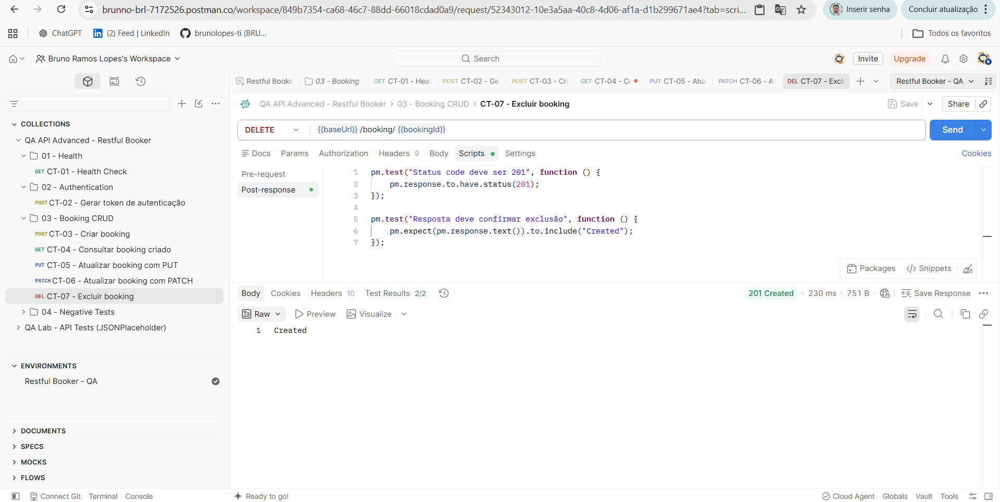

---

## CT-08 - Validar exclusão

Após a exclusão, uma nova consulta é realizada:

```http
GET /booking/{{bookingId}}
```

Resultado esperado:

```text
404 Not Found
```

Isso confirma que o recurso excluído não pode mais ser consultado.

### Evidência

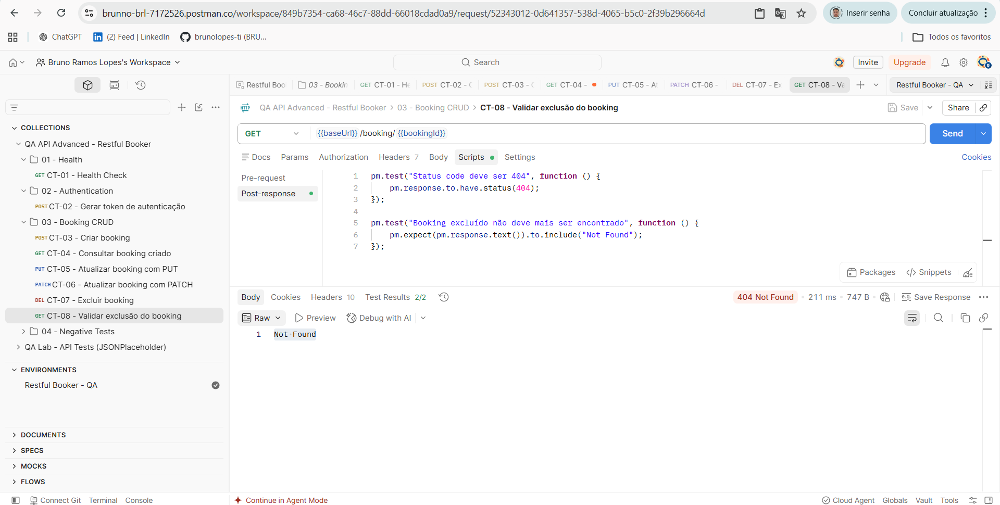

---

# Testes negativos

Além do fluxo principal, foram implementados cenários negativos.

---

## CT-09 - Autenticação com credenciais inválidas

```http
POST /auth
```

É enviada uma senha inválida.

Resultado retornado:

```json
{
  "reason": "Bad credentials"
}
```

Validações:

- Resposta da API;
- Mensagem de credenciais inválidas;
- Ausência de token.

### Evidência

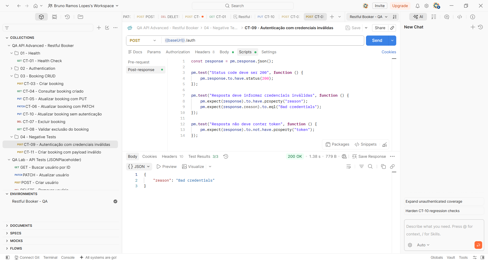

---

## CT-10 - Atualização sem autenticação

Tentativa de atualizar um booking sem token válido.

Resultado esperado:

```text
403 Forbidden
```

Validações:

- Acesso bloqueado;
- Operação protegida contra requisição não autenticada.

### Evidência

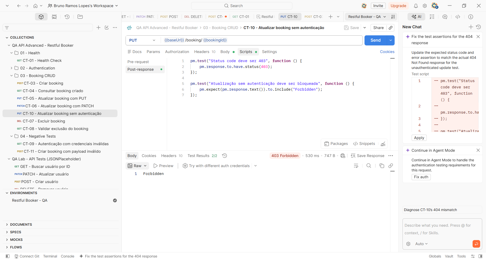

---

## CT-11 - Payload inválido

É enviado um payload propositalmente inválido contendo campos ausentes e tipos incorretos.

O objetivo é validar que a criação não seja concluída com sucesso.

A API de laboratório utilizada pode responder com erro `400` ou `500` nesse cenário, portanto o teste valida a rejeição da operação.

### Evidência

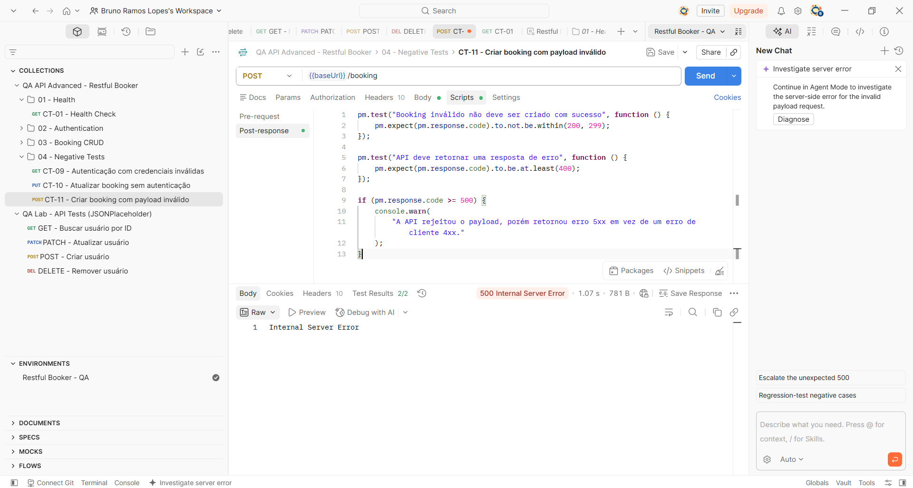

---

# Environment

O projeto utiliza um Environment do Postman para evitar valores fixos dentro das requisições.

Variáveis utilizadas:

```text
baseUrl
username
password
token
bookingId
```

Exemplo:

```text
{{baseUrl}}/booking/{{bookingId}}
```

Os valores de `token` e `bookingId` ficam inicialmente vazios e são preenchidos dinamicamente durante a execução.

Isso permite que a suíte seja executada de forma independente, sem necessidade de inserir manualmente IDs ou tokens gerados anteriormente.

---

# Encadeamento de requisições

A suíte avançada possui dependência controlada entre requisições.

```text
Health Check
      ↓
Autenticação
      ↓
Token
      ↓
Criar Booking
      ↓
bookingId
      ↓
Consultar
      ↓
PUT
      ↓
PATCH
      ↓
DELETE
      ↓
Validar 404
```

Dessa forma, valores retornados pela API são reutilizados automaticamente nos próximos cenários.

---

# Execução com Newman

O projeto pode ser executado fora da interface gráfica do Postman utilizando Newman.

Instale as dependências:

```bash
npm install
```

---

## Executar somente a suíte básica

```bash
npm run api:basic
```

---

## Executar somente a suíte avançada

```bash
npm run api:advanced
```

---

## Executar todo o projeto

```bash
npm run api
```

O comando completo executa primeiro a suíte JSONPlaceholder e, em seguida, a suíte Restful Booker.

---

# Scripts npm

Configuração disponível no `package.json`:

```json
"scripts": {
  "api": "npm run api:basic && npm run api:advanced",
  "api:basic": "newman run \"collections/QA Lab - API Tests (JSONPlaceholder).postman_collection.json\"",
  "api:advanced": "newman run \"collections/QA API Advanced - Restful Booker.postman_collection.json\" -e \"environments/Restful Booker - QA.postman_environment.json\""
}
```

---

# Resultado da suíte avançada

Resultado obtido com Newman:

```text
Iterations:     1
Requests:      11
Test Scripts:  11
Assertions:    36
Failures:       0
```

Tempo registrado na execução:

```text
Total duration: 3.2s
Average response time: ~195ms
```

### Evidência

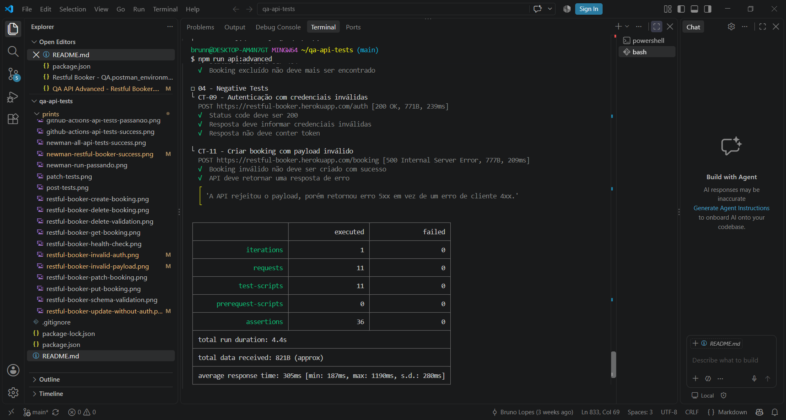

---

# Execução completa

As duas collections também foram executadas em sequência utilizando:

```bash
npm run api
```

A execução concluiu sem falhas.

### Evidência

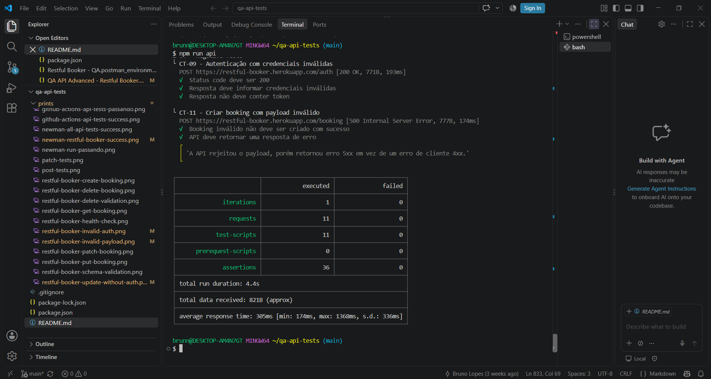

---

# GitHub Actions - CI/CD

O projeto possui pipeline configurado com **GitHub Actions**.

Arquivo:

```text
.github/workflows/api-tests.yml
```

O workflow é acionado automaticamente em:

```text
push
pull_request
```

na branch:

```text
main
```

Etapas do pipeline:

```text
Checkout repository
        ↓
Setup Node.js
        ↓
npm ci
        ↓
npm run api
        ↓
Newman
        ↓
Resultado dos testes
```

Como `npm run api` executa as duas collections, tanto a suíte básica quanto a suíte avançada fazem parte da validação automatizada do pipeline.

---

## Resultado no GitHub Actions

A execução automatizada foi concluída com sucesso após o envio da suíte avançada ao repositório.

### Evidência

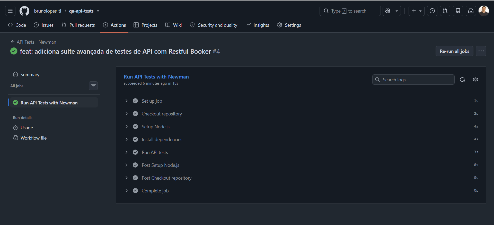

---

# Fluxo completo do projeto

```text
Postman
   ↓
Collections
   ↓
Environment
   ↓
Requisições HTTP
   ↓
API REST
   ↓
Resposta JSON
   ↓
Scripts JavaScript
   ↓
Assertions
   ↓
Variáveis dinâmicas
   ↓
Newman
   ↓
npm
   ↓
GitHub Actions
   ↓
CI/CD
```

---

# Boas práticas aplicadas

- Separação entre suíte básica e avançada;
- Organização das collections;
- Environment separado da collection;
- URLs parametrizadas;
- Variáveis dinâmicas;
- Reaproveitamento de dados;
- Autenticação por token;
- Encadeamento de requisições;
- Validação de status codes;
- Validação de payloads;
- JSON Schema Validation;
- Testes positivos;
- Testes negativos;
- CRUD completo;
- Scripts JavaScript;
- Assertions automatizadas;
- Execução via CLI;
- Automação com Newman;
- Scripts npm;
- Integração contínua;
- GitHub Actions;
- Registro de evidências;
- Versionamento com Git e GitHub;
- Documentação técnica.

---

# Competências demonstradas

Este projeto demonstra prática em:

- Quality Assurance;
- API Testing;
- REST API;
- Postman;
- Newman;
- JavaScript;
- Node.js;
- JSON;
- JSON Schema;
- Métodos HTTP;
- GET;
- POST;
- PUT;
- PATCH;
- DELETE;
- Status codes;
- Headers;
- Cookies;
- Payloads;
- Assertions;
- Test Scripts;
- Variáveis de ambiente;
- Autenticação;
- Tokens;
- Encadeamento de dados;
- CRUD;
- Testes negativos;
- Schema Validation;
- Execução via CLI;
- Automação de testes de API;
- npm;
- GitHub Actions;
- CI/CD;
- Git;
- GitHub;
- Evidências;
- Documentação técnica.

---

# Status do projeto

**Concluído nesta etapa.**

O projeto atualmente possui:

- 2 collections;
- 2 APIs públicas utilizadas;
- 15 requisições entre as duas suítes;
- 47 assertions nas execuções documentadas;
- CRUD completo na suíte avançada;
- Environment;
- Autenticação e token;
- Variáveis dinâmicas;
- Encadeamento entre requisições;
- JSON Schema Validation;
- Testes negativos;
- Newman;
- Scripts npm;
- Pipeline com GitHub Actions;
- Execução local sem falhas;
- Execução em CI/CD com sucesso;
- Evidências documentadas.

---

# Observação sobre a API de laboratório

O Restful Booker é uma API pública destinada a estudos e testes.

Os dados podem ser reinicializados periodicamente pela própria aplicação. Por esse motivo, a suíte cria dinamicamente um novo booking e utiliza o ID retornado durante a própria execução, reduzindo dependência de dados previamente existentes.

---

# Próximas melhorias possíveis

O projeto está concluído para o escopo atual.

Possíveis evoluções futuras incluem:

- Dados de teste externos;
- Relatório HTML do Newman;
- Mocks e stubs;
- Testes de contrato;
- Segurança de APIs;
- OAuth 2.0 em uma API compatível;
- Webhooks em uma API compatível.

---

# Autor

**Bruno Ramos Lopes**

LinkedIn: [linkedin.com/in/brunolopes-ti](https://linkedin.com/in/brunolopes-ti)  
GitHub: [github.com/brunolopes-ti](https://github.com/brunolopes-ti)