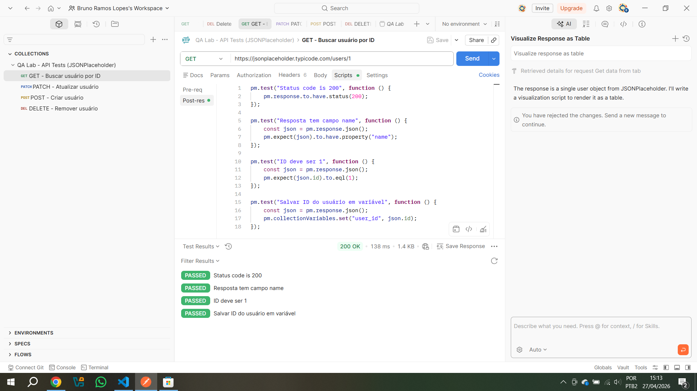
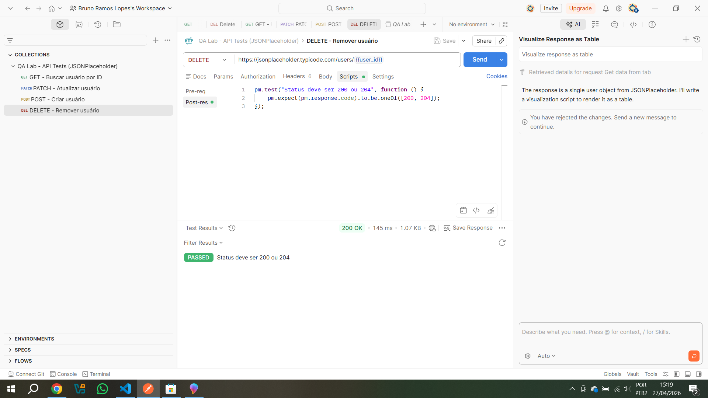
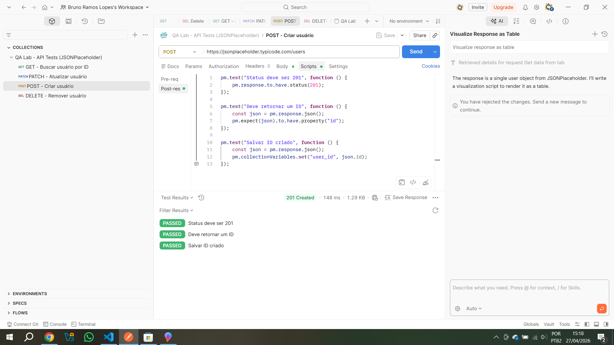
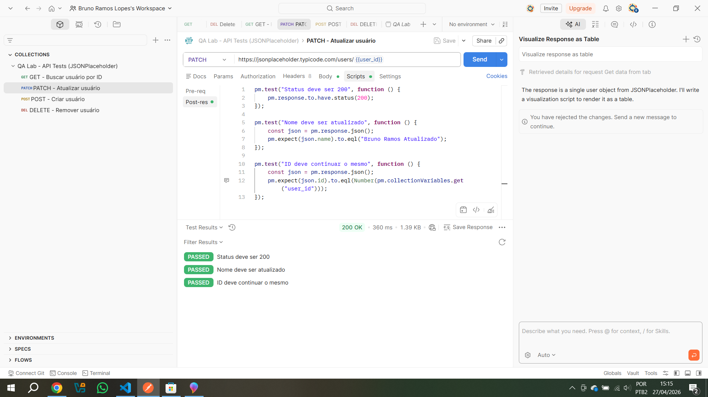

## QA Lab – API Tests com Postman

Projeto prático de testes de API REST utilizando Postman, com validações automatizadas, uso de variáveis dinâmicas e execução de fluxo CRUD.

Este projeto simula um cenário real de QA, validando endpoints e garantindo a consistência das respostas da API.


## Objetivo

Validar endpoints da API pública JSONPlaceholder aplicando práticas de QA em testes de API, incluindo:

- Validação de status code  
- Validação de campos no JSON  
- Uso de variáveis dinâmicas  
- Execução de fluxo CRUD  
- Organização de collection no Postman  

## API utilizada

- JSONPlaceholder  
- Endpoint base: `https://jsonplaceholder.typicode.com`  


## Ferramentas utilizadas

- Postman  
- JavaScript (scripts de teste)  
- Git e GitHub  

## Cenários testados

| Método | Cenário | Endpoint | Validações |
|--------|--------|----------|------------|
| GET | Buscar usuário por ID | `/users/1` | Status 200, campo `name`, ID correto e salvamento de variável |
| POST | Criar usuário | `/users` | Status 201, retorno de ID e salvamento de variável |
| PATCH | Atualizar usuário | `/users/{{user_id}}` | Status 200, nome atualizado e ID mantido |
| DELETE | Remover usuário | `/users/{{user_id}}` | Status 200 ou 204 |


## Uso de variável dinâmica

Foi utilizada a variável `user_id` para reaproveitar o ID retornado nas requisições e encadear o fluxo entre os métodos.

```javascript
pm.collectionVariables.set("user_id", json.id);
```

## Evidências dos testes  

### GET - Buscar usuário por ID  


### DELETE - Remover usuário


### POST - Criar usuário  


### PATCH - Atualizar usuário 



## Estrutura do projeto  

qa-api-tests/  
├── collections/  
├── prints/  
└── README.md  


## Observação

A API JSONPlaceholder é uma API pública de testes. As operações POST, PATCH e DELETE simulam alterações, mas não persistem dados permanentemente.  


## Aprendizados  

Com este projeto, desenvolvi habilidades práticas em:  

- Testes de API utilizando Postman  
- Escrita de testes automatizados com JavaScript  
- Validação de respostas JSON e status codes  
- Uso de variáveis dinâmicas para encadeamento de requisições  
- Organização de cenários de teste e evidências para documentação técnica


## Contato  

Projeto desenvolvido por Bruno Ramos Lopes  

GitHub: https://github.com/brunolopes-ti  
LinkedIn: https://linkedin.com/in/brunolopes-ti  

